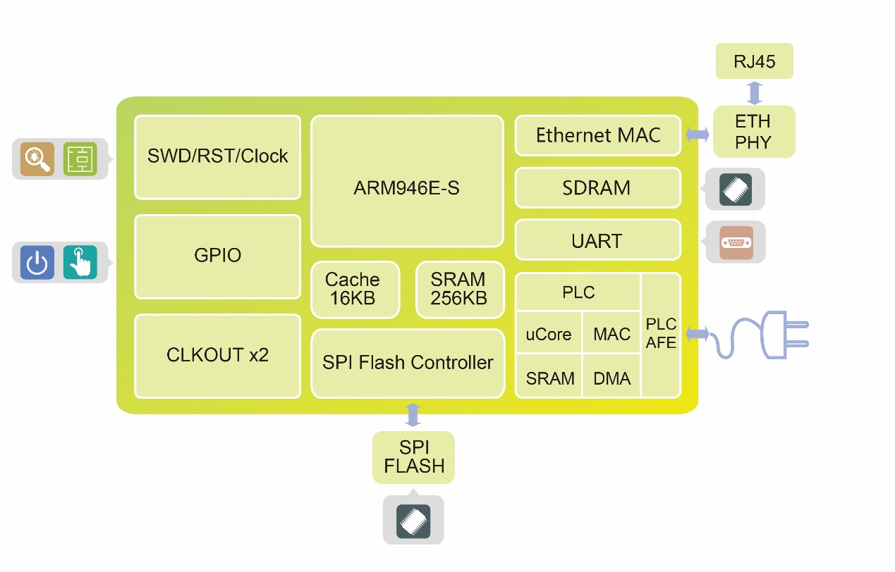
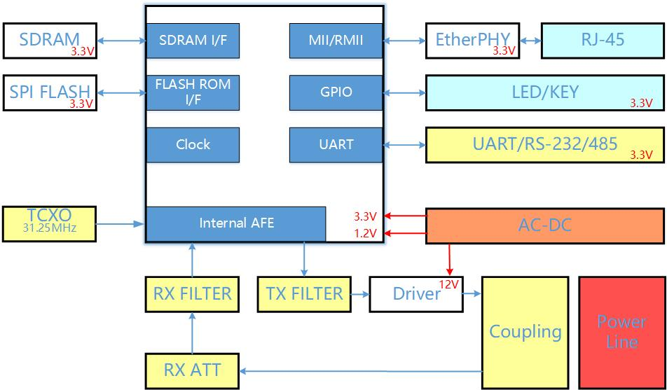

# [CR710](https://github.com/SoCXin/CR710)

* [cloudersemi](http://www.cloudersemi.com/)：[ARM946E-S](https://github.com/SoCXin/Cortex)
* [L4R6](https://github.com/SoCXin/Level)：125 MHz

## [简介](https://github.com/SoCXin/CR710/wiki)

[CR710](https://github.com/SoCXin/CR710) 单芯片高速宽带电力线载波芯片，内部集成高性能模拟前端（AFE），物理层速率可到240Mbps，内置中继路由算法，可应用于需要大数据量传输以及高实时性要求的场合。

将CR100集成在了芯片内部，无需外置，大大降低了芯片面积以及设计难度。简化了应用。

CR710可在电力线（交流、直流）、同轴等线缆上进行高速数字信号的传输。已广泛应用于智能家居、安防监控、智慧路灯、光伏发电、智能门铃、电梯物联网、地铁等行业领域。

### 关键特性

* PLC:OFDM，频率2MHz~28MHz，自带FEC纠错与校验
* 采用OFDM调制解调技术，最大物理层传输速度240Mbps；
* 采用多跳中继技术，最大10级中继，在电力线上传输距离最长10公里；
* 自动组网，自动路由；
* 支持不同种类通信线缆——直流/交流电力线、双绞线、同轴线、电话线。在电力线上传播500米，在同轴线上传播2000米；
* 符合欧盟EN-50561标准规范；
* 载波带宽为2~28MHz；
* 信号动态范围可达90dB；
* 中继延迟最大10ms；
* 工作功耗小于1W，待机功耗小于0.2W。

### [资源收录](https://github.com/SoCXin)

* [参考资源](src/)
* [参考文档](docs/)
* [参考工程](project/)

### [选型建议](https://github.com/SoCXin)

[CR710](https://github.com/SoCXin/CR710)

* CR700封装为TQFP-128（16X16mm）
* CR100封装为VQFN-64（9X9mm）
* CR710封装为TQFP-144（18X18mm）

### [探索芯世界 www.SoC.xin](http://www.SoC.Xin)
